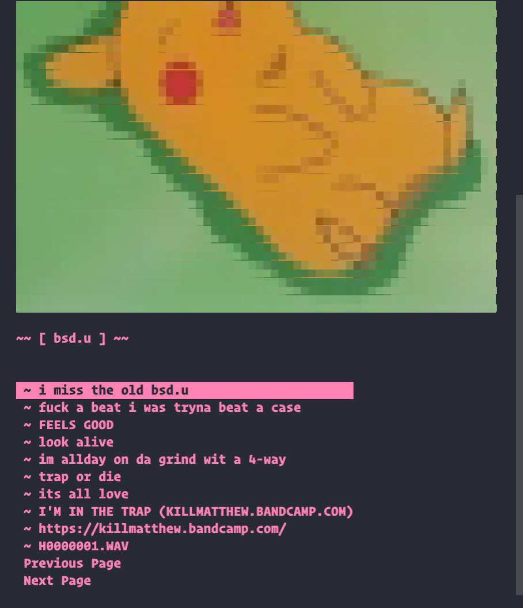

# soundcloudTerminal 🎛️

<div style="float: left;">
  
  
</div>

Utilize SoundCloud within a terminal environment, play SoundCloud tracks by searching for a track or an artist **without** the interuption of **ads**. If you plan to use any of the code featured in this project please give me credit! 
This is still under devlopment so **expect bugs!!! :beetle:**

## Features :wrench:

• Stream songs from SoundCloud with autoplay that's relative to your first selected song's genre.<br>
• Download your favorite songs with their [metadata](https://en.wikipedia.org/wiki/ID3).<br>
• Like songs.<br>

## Instructions :memo:

Make sure [Git](https://git-scm.com/) and [node.js](https://nodejs.org/en/download/) are installed!

First, clone the repository to your local machine.

```
git clone https://github.com/ethans333/soundcloudTerminal
```

To install the dependencies, run

```
npm install
```

## Use :thinking:	

```
npm start
```

Also, this hasn't been tested on slower internet connections which may cause issues, if that is the case start a 'new issue' in this repository. If you avidly use this package or have any feature requests please [hit me up](https://www.instagram.com/ethanspams.__/) and I'll be sure to add more features! Happy listening! :blush:
